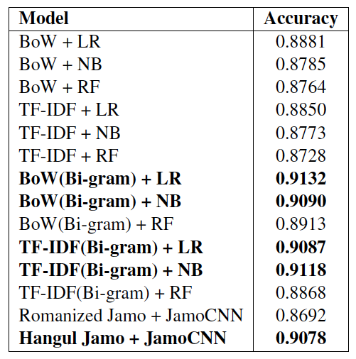

# Jamo-level CNN for non-English text classification

focus on the **character-of-character(a.k.a. jamo)**

ex) '우리는 실패해도 앞으로 나아가야 합니다' -> 'ㅇㅜㄹㅣㄴㅡㄴㅅㅣㄹㅍㅐㅎㅐㄷㅗㅇㅏㅍㅇㅡㄹㅗㄴㅏㅇㅏㄱㅏㅇㅑㅎㅏㅂㄴㅣㄷㅏ'

### Model Architecture

---

### Data
1. naver movie review 300,000
   * positive review 150,000
   * negative review 150,000

### Result

---

### Reference

1. Kim, Yoon. "Convolutional neural networks for sentence classification." In Proceedings of EMNLP 2014.
2. Zhang, Xiang, Junbo Zhao, and Yann LeCun. "Character-level convolutional networks for text classification." Advances in neural information processing systems. 2015.
3. Kim, Hyunjoong. hangle.py https://github.com/lovit/soynlp
4. python code is based on from https://github.com/dennybritz/cnn-text-classification-tf
